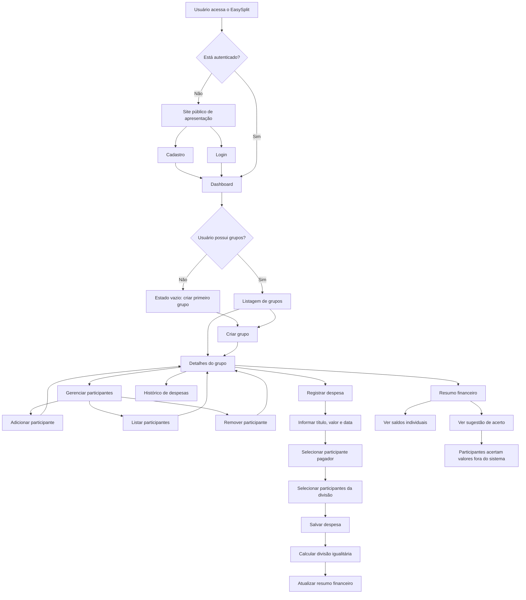
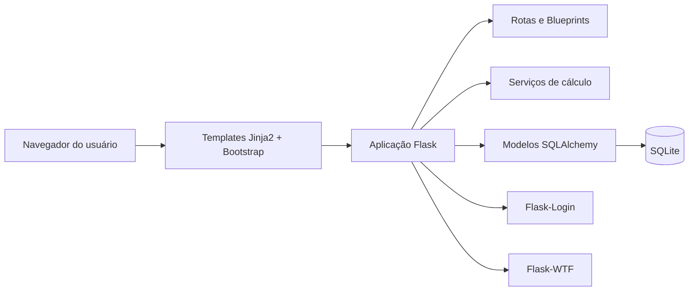
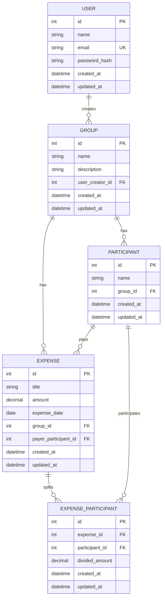

# PRD - EasySplit

**Produto:** EasySplit  
**Tipo de solução:** Sistema web para gerenciamento e divisão de despesas compartilhadas  
**Tecnologia principal:** Python com Flask  
**Público-alvo:** Jovens, universitários, grupos de amigos, repúblicas e pessoas que dividem custos  

---

## 1. Visão geral

O EasySplit é um sistema web para divisão de contas entre amigos, grupos, repúblicas, viagens, eventos e situações em que várias pessoas compartilham despesas.

O produto permite que um usuário crie grupos, cadastre participantes, registre despesas pagas por diferentes pessoas e visualize automaticamente quanto cada participante deve pagar ou receber. O MVP será simples, objetivo e focado em resolver o problema central: organizar despesas compartilhadas e calcular saldos de forma clara, automática e confiável.

O sistema será construído como uma aplicação web full stack usando Flask, templates Jinja2, Bootstrap, JavaScript pontual e banco de dados relacional SQLite no MVP.

---

## 2. Sobre o produto

### 2.1 Problema

Dividir contas em grupo costuma gerar confusão quando diferentes pessoas pagam valores distintos ao longo do tempo. Em muitos cenários, os participantes precisam recorrer a cálculos manuais, conversas antigas, anotações soltas ou planilhas improvisadas.

Essas práticas geram problemas como:

- Erros no cálculo da divisão.
- Esquecimento de despesas pagas por algum participante.
- Cobranças incorretas ou duplicadas.
- Falta de transparência sobre quem pagou, quem deve e quem deve receber.
- Desconforto entre os participantes ao cobrar valores pendentes.
- Perda de tempo para chegar ao valor final de acerto.

### 2.2 Solução proposta

O EasySplit centraliza as despesas de um grupo em um único ambiente e calcula automaticamente os saldos individuais de cada participante.

A solução permite:

- Criar grupos para contextos diferentes, como viagem, aluguel, evento, festa ou compra coletiva.
- Adicionar participantes ao grupo.
- Registrar despesas informando título, valor, data, pagador e participantes envolvidos na divisão.
- Dividir despesas igualmente entre os participantes selecionados.
- Calcular o saldo de cada pessoa.
- Exibir quem deve pagar e quem deve receber.
- Sugerir acertos simples entre participantes.
- Consultar histórico de despesas registradas.

### 2.3 Escopo do MVP

#### Incluído no MVP

- Cadastro de usuários.
- Login e logout.
- Criação e listagem de grupos.
- Gerenciamento de participantes por grupo.
- Registro de despesas compartilhadas.
- Divisão igualitária entre participantes selecionados.
- Cálculo automático de saldos.
- Resumo financeiro do grupo.
- Histórico de despesas.
- Sugestão simples de acerto de contas.
- Interface responsiva para desktop e celular.

#### Fora do MVP

- Pagamentos reais.
- Integração com Pix.
- Integração bancária.
- Aplicativo mobile nativo.
- Múltiplas moedas.
- Notificações externas por email, SMS, WhatsApp ou push.
- Divisão por porcentagem ou valores personalizados.
- Convite por link.
- Relatórios em PDF.

#### Possíveis melhorias futuras

- Divisão personalizada por porcentagem.
- Divisão por cotas ou valores individuais.
- Convite de participantes por link.
- Geração de relatório em PDF.
- Integração com Pix para facilitar pagamentos.
- Notificações automáticas de pendências.
- Exportação de histórico em CSV.
- Suporte a múltiplas moedas.

---

## 3. Propósito

O propósito do EasySplit é reduzir atritos financeiros em grupos, tornando a divisão de despesas mais simples, transparente e confiável.

O produto deve ajudar o usuário a responder rapidamente:

- Quanto o grupo gastou no total?
- Quem pagou cada despesa?
- Quanto cada participante deveria pagar?
- Quem está com saldo positivo e deve receber?
- Quem está com saldo negativo e deve pagar?
- Qual é a forma mais simples de acertar as contas?

---

## 4. Público alvo

### 4.1 Público principal

- Jovens e universitários que dividem despesas em viagens, festas, encontros ou projetos.
- Moradores de repúblicas que compartilham aluguel, contas domésticas e compras coletivas.
- Grupos de amigos que realizam eventos, churrascos, compras em conjunto ou viagens.
- Pequenos grupos que precisam organizar gastos sem depender de planilhas complexas.

### 4.2 Necessidades do público

- Registrar despesas de forma rápida.
- Evitar cálculos manuais.
- Ter clareza sobre os valores de cada participante.
- Consultar o histórico do grupo quando necessário.
- Evitar discussões ou dúvidas sobre quem pagou cada item.
- Usar o sistema pelo celular durante situações do dia a dia.

### 4.3 Personas

#### Persona 1 - Universitário em república

- Divide aluguel, internet, energia, mercado e compras domésticas.
- Precisa saber quanto cada morador deve no fim do mês.
- Quer uma interface simples, sem planilhas complexas.

#### Persona 2 - Grupo de amigos em viagem

- Várias pessoas pagam despesas diferentes, como combustível, hospedagem e alimentação.
- Precisa consolidar tudo ao final da viagem.
- Quer uma sugestão objetiva de quem paga para quem.

#### Persona 3 - Organizador de evento pequeno

- Centraliza gastos de um encontro, festa ou churrasco.
- Precisa registrar despesas pagas por diferentes participantes.
- Quer transparência para prestar contas ao grupo.

---

## 5. Objetivos

### 5.1 Objetivos de produto

- Permitir que usuários organizem despesas compartilhadas por grupo.
- Reduzir erros em cálculos manuais de divisão.
- Exibir saldos individuais de forma clara e objetiva.
- Oferecer histórico consultável das despesas registradas.
- Apresentar uma sugestão simples de acerto de contas.
- Entregar um MVP funcional, simples e viável no contexto da disciplina.

### 5.2 Objetivos técnicos

- Desenvolver uma aplicação web com Flask.
- Usar arquitetura simples e modular.
- Persistir dados em banco relacional SQLite no MVP.
- Usar SQLAlchemy para modelagem e consultas.
- Usar Flask-Login para autenticação.
- Usar Flask-WTF para formulários.
- Usar Jinja2 para templates.
- Usar Bootstrap para interface responsiva.
- Manter regras de negócio no backend.
- Garantir senhas armazenadas com hash.

### 5.3 Objetivos de UX

- Criar uma navegação simples e intuitiva.
- Facilitar o registro de despesas em poucos passos.
- Exibir os saldos com linguagem clara.
- Diferenciar visualmente quem deve pagar e quem deve receber.
- Garantir boa experiência em computador e celular.

---

## 6. Requisitos funcionais

### RF01 - Cadastro de usuários

O sistema deve permitir que uma pessoa crie uma conta informando dados básicos, como nome, email e senha.

**Critérios de aceite:**

- O usuário consegue acessar a tela de cadastro.
- O usuário consegue criar uma conta com dados válidos.
- O sistema impede cadastro com email já existente.
- A senha não é armazenada em texto puro.
- Após cadastro bem-sucedido, o usuário pode fazer login.

### RF02 - Login e logout

O sistema deve permitir que usuários cadastrados façam login e logout.

**Critérios de aceite:**

- O usuário consegue fazer login com email e senha válidos.
- O usuário não consegue fazer login com credenciais inválidas.
- O usuário autenticado consegue encerrar a sessão.
- Rotas privadas redirecionam usuários não autenticados para o login.

### RF03 - Dashboard principal

Após o login, o usuário deve ser direcionado para um dashboard com visão geral dos seus grupos.

**Critérios de aceite:**

- O dashboard lista os grupos criados pelo usuário.
- O dashboard apresenta uma opção clara para criar novo grupo.
- O usuário consegue acessar os detalhes de cada grupo.
- Quando não houver grupos, o sistema exibe um estado vazio orientando a criação do primeiro grupo.

### RF04 - Criação de grupos

O sistema deve permitir criar grupos para diferentes situações, como viagem, aluguel, evento ou compra coletiva.

**Critérios de aceite:**

- O usuário consegue criar um grupo informando nome e descrição opcional.
- O grupo fica vinculado ao usuário criador.
- O grupo criado aparece no dashboard.
- O sistema valida o preenchimento do nome do grupo.

### RF05 - Listagem e detalhes de grupos

O sistema deve permitir visualizar os detalhes de um grupo específico.

**Critérios de aceite:**

- O usuário consegue acessar a página de detalhes do grupo.
- A página exibe nome, descrição, participantes, despesas, total gasto, saldos e sugestão de acerto.
- O usuário só consegue acessar grupos vinculados à sua conta.

### RF06 - Gerenciamento de participantes

O sistema deve permitir adicionar, listar e remover participantes vinculados a um grupo.

**Critérios de aceite:**

- O usuário consegue adicionar participantes pelo nome.
- O sistema lista todos os participantes do grupo.
- O usuário consegue remover participantes quando não houver impacto indevido em despesas já registradas.
- O sistema evita participantes sem nome.
- O sistema evita duplicidades evidentes no mesmo grupo quando possível.

### RF07 - Registro de despesas

O sistema deve permitir cadastrar uma despesa informando título, valor, data, participante pagador e participantes envolvidos na divisão.

**Critérios de aceite:**

- O usuário consegue acessar o formulário de nova despesa dentro de um grupo.
- O usuário informa título, valor, data, pagador e participantes da divisão.
- O valor da despesa deve ser maior que zero.
- O pagador deve pertencer ao grupo.
- Os participantes envolvidos devem pertencer ao grupo.
- A despesa criada aparece no histórico do grupo.

### RF08 - Divisão igualitária de despesas

O sistema deve dividir automaticamente cada despesa igualmente entre os participantes selecionados.

**Critérios de aceite:**

- O valor dividido por participante é calculado a partir do valor total da despesa e da quantidade de participantes selecionados.
- O sistema salva a relação entre despesa e participantes envolvidos.
- O cálculo considera apenas os participantes selecionados para aquela despesa.
- O pagador também pode participar da divisão, quando selecionado.

### RF09 - Cálculo automático de saldos

O sistema deve calcular automaticamente o saldo de cada participante com base nas despesas registradas.

**Critérios de aceite:**

- Para cada participante, o sistema calcula o total pago.
- Para cada participante, o sistema calcula o total devido.
- O saldo deve ser calculado como: `saldo = total_pago - total_devido`.
- Participantes com saldo positivo devem receber.
- Participantes com saldo negativo devem pagar.
- Participantes com saldo zero estão quitados.

### RF10 - Resumo financeiro do grupo

O sistema deve exibir um painel com total gasto, valores por participante e saldos individuais.

**Critérios de aceite:**

- O painel exibe o total gasto no grupo.
- O painel exibe o total pago por participante.
- O painel exibe o total devido por participante.
- O painel exibe o saldo final por participante.
- A tela diferencia visualmente valores a pagar, a receber e quitados.

### RF11 - Histórico de despesas

O sistema deve listar as despesas registradas para consulta e conferência posterior.

**Critérios de aceite:**

- O histórico mostra título, valor, data e pagador.
- O histórico permite identificar os participantes envolvidos na divisão.
- O histórico é ordenado de forma clara, preferencialmente por data mais recente.
- O usuário consegue conferir os dados usados no cálculo do resumo.

### RF12 - Sugestão simples de acerto de contas

O sistema deve apresentar uma sugestão simples de pagamentos entre participantes para zerar os saldos do grupo.

**Critérios de aceite:**

- O sistema identifica devedores e recebedores.
- O sistema sugere transferências entre quem deve pagar e quem deve receber.
- A sugestão usa os saldos calculados automaticamente.
- A soma final dos acertos sugeridos deve tender a zerar os saldos do grupo.
- A sugestão deve ser exibida em linguagem simples, por exemplo: `João paga R$ 25,00 para Maria`.

### RF13 - Site público de apresentação

O sistema deve possuir uma página pública simples apresentando o EasySplit.

**Critérios de aceite:**

- Usuários não autenticados conseguem acessar a página inicial.
- A página explica a proposta de valor do produto.
- A página possui botões de cadastro e login.
- A página funciona bem em desktop e celular.

### RF14 - Mensagens de feedback

O sistema deve exibir mensagens de feedback para ações relevantes.

**Critérios de aceite:**

- O sistema exibe mensagem ao criar grupo com sucesso.
- O sistema exibe mensagem ao adicionar participante com sucesso.
- O sistema exibe mensagem ao registrar despesa com sucesso.
- O sistema exibe mensagens de erro para validações inválidas.
- As mensagens seguem o padrão visual do sistema.

### 6.1 Flowchart Mermaid com fluxos de UX



---

## 7. Regras de negócio

### RN01 - Grupo obrigatório

Cada despesa deve pertencer obrigatoriamente a um grupo.

### RN02 - Pagador obrigatório

Cada despesa deve possuir um participante responsável pelo pagamento.

### RN03 - Participantes vinculados ao grupo

O pagador e os participantes envolvidos na divisão devem pertencer ao mesmo grupo da despesa.

### RN04 - Divisão padrão igualitária

No MVP, a divisão será igualitária entre os participantes selecionados na despesa.

### RN05 - Cálculo do valor dividido

O valor dividido por participante será calculado como:

```text
valor_dividido = valor_total_da_despesa / quantidade_de_participantes_selecionados
```

### RN06 - Cálculo do saldo

O saldo de cada participante será calculado como:

```text
saldo = total_pago_pelo_participante - total_que_o_participante_deveria_pagar
```

### RN07 - Interpretação do saldo

- Saldo positivo: participante deve receber.
- Saldo negativo: participante deve pagar.
- Saldo igual a zero: participante está quitado.

### RN08 - Sugestão de acerto

A sugestão de acerto deve conectar participantes com saldo negativo a participantes com saldo positivo, indicando valores de pagamento até reduzir os saldos pendentes.

### RN09 - Sem pagamento real

O sistema apenas calcula e sugere acertos. O pagamento real acontece fora da aplicação.

### RN10 - Acesso aos dados

Um usuário autenticado só deve visualizar e gerenciar grupos criados por ele ou vinculados à sua conta no MVP.

---

## 8. Requisitos não-funcionais

### RNF01 - Responsividade

A interface deve funcionar adequadamente em computador, tablet e celular.

### RNF02 - Simplicidade de uso

As telas devem ser objetivas, com navegação clara e sem excesso de funcionalidades fora do escopo do MVP.

### RNF03 - Segurança de senha

As senhas devem ser armazenadas com hash, nunca em texto puro.

### RNF04 - Controle de acesso

Rotas privadas devem exigir autenticação. Dados de grupos devem ser protegidos contra acesso indevido.

### RNF05 - Performance básica

Operações de cadastro, login, listagem, registro de despesas e cálculo de resumo devem responder em tempo adequado para uso normal do MVP.

### RNF06 - Persistência de dados

Os dados devem ser persistidos em banco relacional, usando SQLite no MVP.

### RNF07 - Organização de código

O código deve ser organizado em módulos, separando autenticação, grupos, despesas, modelos, formulários, templates e arquivos estáticos.

### RNF08 - Manutenibilidade

Regras de negócio de cálculo devem ficar centralizadas em serviços ou funções específicas, evitando duplicação de lógica em rotas e templates.

### RNF09 - Consistência visual

Todas as telas devem seguir o mesmo padrão visual, com componentes reutilizáveis para navegação, cards, botões, formulários, tabelas, alertas e badges.

### RNF10 - Compatibilidade

A aplicação deve funcionar em navegadores modernos, como Chrome, Edge, Firefox e Safari.

### RNF11 - Acessibilidade básica

A interface deve usar contraste adequado, labels em campos de formulário e feedback visual compreensível.

### RNF12 - Idioma

Toda informação exibida ao usuário final deve estar em português brasileiro.

---

## 9. Arquitetura técnica

### 9.1 Visão arquitetural

A aplicação seguirá uma arquitetura web cliente-servidor. O navegador acessa as páginas renderizadas pelo Flask, que processa rotas, autenticação, formulários, regras de negócio e integração com o banco de dados.



### 9.2 Stack

| Camada/Recurso | Tecnologia |
|---|---|
| Linguagem | Python |
| Backend | Flask |
| Templates | Jinja2 |
| Frontend | HTML, CSS, Bootstrap e JavaScript pontual |
| Banco de dados | SQLite no MVP |
| ORM | SQLAlchemy |
| Autenticação | Flask-Login |
| Formulários | Flask-WTF |
| Validações | WTForms e validações no backend |
| Visualizações | Chart.js ou componentes simples do Bootstrap |
| Estilos customizados | CSS próprio sobre Bootstrap |
| Controle de versão | Git |

### 9.3 Diretrizes técnicas

- Usar Flask de forma simples, sem over engineering.
- Separar responsabilidades por módulos ou blueprints.
- Manter templates reutilizáveis para layouts, navegação, cards, formulários e mensagens.
- Centralizar extensões em arquivo próprio, como `extensions.py`.
- Centralizar regras de cálculo em serviço específico, como `services/settlement_service.py`.
- Evitar regras de negócio complexas dentro dos templates.
- Usar nomes de variáveis, funções e classes em inglês no código sempre que possível.
- Exibir textos de interface em português brasileiro.
- Validar dados no backend, mesmo que existam validações no frontend.
- Usar migrations caso o projeto utilize Flask-Migrate.

### 9.4 Estrutura inicial de diretórios sugerida

```text
easysplit/
├── app/
│   ├── __init__.py
│   ├── config.py
│   ├── extensions.py
│   ├── models.py
│   ├── auth/
│   │   ├── __init__.py
│   │   ├── forms.py
│   │   └── routes.py
│   ├── groups/
│   │   ├── __init__.py
│   │   ├── forms.py
│   │   └── routes.py
│   ├── expenses/
│   │   ├── __init__.py
│   │   ├── forms.py
│   │   └── routes.py
│   ├── services/
│   │   ├── __init__.py
│   │   └── settlement_service.py
│   ├── static/
│   │   ├── css/
│   │   │   └── main.css
│   │   └── js/
│   │       └── main.js
│   └── templates/
│       ├── base.html
│       ├── public/
│       │   └── home.html
│       ├── auth/
│       │   ├── login.html
│       │   └── register.html
│       ├── groups/
│       │   ├── dashboard.html
│       │   ├── detail.html
│       │   └── form.html
│       └── expenses/
│           └── form.html
├── migrations/
├── instance/
│   └── easysplit.sqlite
├── requirements.txt
├── run.py
└── README.md
```

### 9.5 Estrutura de dados com schemas em Mermaid



### 9.6 Descrição das entidades

#### User

Representa o usuário autenticado do sistema.

Campos principais:

- `id`: identificador único.
- `name`: nome do usuário.
- `email`: email usado para login.
- `password_hash`: senha protegida por hash.
- `created_at`: data de criação.
- `updated_at`: data de atualização.

#### Group

Representa um grupo de despesas, como viagem, aluguel ou evento.

Campos principais:

- `id`: identificador único.
- `name`: nome do grupo.
- `description`: descrição opcional.
- `user_creator_id`: usuário que criou o grupo.
- `created_at`: data de criação.
- `updated_at`: data de atualização.

#### Participant

Representa uma pessoa participante de um grupo.

Campos principais:

- `id`: identificador único.
- `name`: nome do participante.
- `group_id`: grupo ao qual o participante pertence.
- `created_at`: data de criação.
- `updated_at`: data de atualização.

#### Expense

Representa uma despesa cadastrada no grupo.

Campos principais:

- `id`: identificador único.
- `title`: título da despesa.
- `amount`: valor total.
- `expense_date`: data da despesa.
- `group_id`: grupo da despesa.
- `payer_participant_id`: participante que pagou.
- `created_at`: data de criação.
- `updated_at`: data de atualização.

#### ExpenseParticipant

Representa quais participantes fazem parte da divisão de uma despesa.

Campos principais:

- `id`: identificador único.
- `expense_id`: despesa vinculada.
- `participant_id`: participante vinculado.
- `divided_amount`: valor dividido para aquele participante.
- `created_at`: data de criação.
- `updated_at`: data de atualização.

### 9.7 Serviço de cálculo financeiro

O cálculo deve ser implementado em uma camada isolada, para facilitar manutenção.

Responsabilidades do serviço:

- Receber as despesas de um grupo.
- Somar quanto cada participante pagou.
- Somar quanto cada participante deveria pagar.
- Calcular saldo individual.
- Separar participantes devedores e recebedores.
- Gerar uma lista simples de acertos.

Fluxo do algoritmo:

```text
1. Inicializar totais de todos os participantes com zero.
2. Para cada despesa:
   2.1. Adicionar o valor total ao total pago do pagador.
   2.2. Dividir o valor entre os participantes selecionados.
   2.3. Adicionar o valor dividido ao total devido de cada participante.
3. Para cada participante:
   3.1. Calcular saldo = total pago - total devido.
4. Criar lista de recebedores com saldo positivo.
5. Criar lista de devedores com saldo negativo.
6. Gerar sugestões conectando devedores e recebedores até zerar os saldos.
```

---

## 10. Design system

O design do EasySplit deve transmitir clareza, confiança e praticidade. Como o objetivo é resolver cálculos de despesas compartilhadas, a interface deve priorizar leitura fácil, hierarquia visual e ações evidentes.

A implementação visual será feita com Bootstrap, CSS customizado e templates Jinja2.

### 10.1 Direção visual

- Visual moderno, limpo e responsivo.
- Componentes consistentes em todas as páginas.
- Uso de cards para grupos, resumos e saldos.
- Botões claros para ações principais.
- Cores semânticas para indicar valores positivos, negativos e neutros.
- Layout mobile-first.

### 10.2 Paleta de cores

| Uso | Cor | Hex |
|---|---:|---:|
| Primária | Azul confiança | `#2563EB` |
| Primária escura | Azul profundo | `#1E3A8A` |
| Secundária | Ciano leve | `#06B6D4` |
| Sucesso / receber | Verde | `#16A34A` |
| Atenção / pagar | Vermelho | `#DC2626` |
| Alerta | Amarelo | `#F59E0B` |
| Fundo claro | Cinza muito claro | `#F8FAFC` |
| Fundo de cards | Branco | `#FFFFFF` |
| Texto principal | Grafite | `#111827` |
| Texto secundário | Cinza | `#6B7280` |
| Bordas | Cinza claro | `#E5E7EB` |

### 10.3 Tipografia

- Fonte sugerida: `Inter`, `Roboto` ou fonte padrão do sistema.
- Títulos devem usar peso 600 ou 700.
- Textos de apoio devem usar peso 400.
- Valores financeiros devem ter destaque visual com peso 600.

Exemplo CSS:

```css
:root {
    --color-primary: #2563eb;
    --color-primary-dark: #1e3a8a;
    --color-secondary: #06b6d4;
    --color-success: #16a34a;
    --color-danger: #dc2626;
    --color-warning: #f59e0b;
    --color-bg: #f8fafc;
    --color-card: #ffffff;
    --color-text: #111827;
    --color-muted: #6b7280;
    --color-border: #e5e7eb;
}

body {
    background: var(--color-bg);
    color: var(--color-text);
    font-family: Inter, system-ui, -apple-system, BlinkMacSystemFont, 'Segoe UI', sans-serif;
}
```

### 10.4 Layout base

#### Site público

- Hero com título, subtítulo e CTA.
- Botões de `Criar conta` e `Entrar`.
- Seção com benefícios principais.
- Layout responsivo com cards.

#### Área autenticada

- Navbar superior com logo, grupos e logout.
- Container centralizado com largura máxima.
- Cards para métricas.
- Tabelas responsivas para histórico.
- Formulários em cards.

### 10.5 Botões

#### Botão primário

Uso: ações principais como criar grupo, salvar despesa, adicionar participante.

Classes sugeridas:

```html
<button class="btn btn-primary rounded-3 px-4 fw-semibold">
    Salvar
</button>
```

#### Botão secundário

Uso: voltar, cancelar, acessar detalhes.

```html
<a class="btn btn-outline-secondary rounded-3 px-4" href="#">
    Voltar
</a>
```

#### Botão de perigo

Uso: remover participante ou excluir item permitido.

```html
<button class="btn btn-outline-danger rounded-3 px-4">
    Remover
</button>
```

### 10.6 Inputs e formulários

- Labels sempre visíveis.
- Campos com bordas arredondadas.
- Mensagens de erro abaixo do campo.
- Campos obrigatórios indicados visualmente.
- Formulários dentro de cards.

Exemplo:

```html
<div class="mb-3">
    <label for="title" class="form-label fw-semibold">Título da despesa</label>
    <input type="text" class="form-control rounded-3" id="title" name="title" placeholder="Ex: Mercado">
    <div class="form-text">Informe um nome simples para identificar a despesa.</div>
</div>
```

### 10.7 Cards

Cards devem ser usados para agrupar informações relevantes.

Tipos de cards:

- Card de grupo.
- Card de resumo financeiro.
- Card de saldo individual.
- Card de formulário.
- Card de estado vazio.

Exemplo:

```html
<div class="card border-0 shadow-sm rounded-4">
    <div class="card-body p-4">
        <h2 class="h5 fw-bold mb-2">Viagem para a praia</h2>
        <p class="text-muted mb-3">Despesas da viagem entre amigos.</p>
        <a href="#" class="btn btn-primary rounded-3">Ver grupo</a>
    </div>
</div>
```

### 10.8 Grids

- Usar grid do Bootstrap.
- Em mobile, cards ficam em uma coluna.
- Em tablets, duas colunas.
- Em desktop, três colunas quando fizer sentido.

Exemplo:

```html
<div class="row g-4">
    <div class="col-12 col-md-6 col-lg-4">
        <!-- Card -->
    </div>
</div>
```

### 10.9 Menus e navegação

Navbar autenticada:

- Logo EasySplit.
- Link para dashboard.
- Link para criar grupo.
- Nome do usuário.
- Botão de logout.

Navbar pública:

- Logo EasySplit.
- Link para login.
- Link para cadastro.

### 10.10 Badges e estados financeiros

| Estado | Label | Classe visual sugerida |
|---|---|---|
| Deve receber | `A receber` | `badge text-bg-success` |
| Deve pagar | `A pagar` | `badge text-bg-danger` |
| Quitado | `Quitado` | `badge text-bg-secondary` |

### 10.11 Tabelas

Tabelas devem ser usadas para histórico de despesas.

Colunas sugeridas:

- Data.
- Título.
- Valor.
- Pagador.
- Participantes.

Em telas pequenas, usar `.table-responsive`.

### 10.12 Componentes reutilizáveis

Criar componentes/parciais de template para:

- Navbar.
- Flash messages.
- Card de grupo.
- Card de resumo.
- Linha de saldo.
- Estado vazio.
- Campo de formulário com erro.

---

## 11. User stories

### Épico 1 - Autenticação de usuários

Como usuário, quero criar uma conta e fazer login para acessar meus grupos de despesas com segurança.

#### História 1.1 - Cadastro

Como novo usuário, quero criar uma conta com nome, email e senha para começar a usar o EasySplit.

**Critérios de aceite:**

- Dado que estou na página de cadastro, quando preencho dados válidos, então minha conta é criada.
- Dado que informo um email já cadastrado, quando envio o formulário, então vejo uma mensagem de erro.
- Dado que minha conta foi criada, quando acesso a tela de login, então consigo entrar com minhas credenciais.

#### História 1.2 - Login

Como usuário cadastrado, quero fazer login para acessar meu dashboard.

**Critérios de aceite:**

- Dado que informo email e senha válidos, quando envio o formulário, então sou redirecionado para o dashboard.
- Dado que informo credenciais inválidas, quando envio o formulário, então vejo uma mensagem de erro.

#### História 1.3 - Logout

Como usuário autenticado, quero sair da minha conta para proteger meu acesso.

**Critérios de aceite:**

- Dado que estou logado, quando clico em sair, então minha sessão é encerrada.
- Dado que minha sessão foi encerrada, quando tento acessar rota privada, então sou redirecionado para login.

---

### Épico 2 - Gestão de grupos

Como usuário, quero criar e visualizar grupos para organizar despesas de diferentes situações.

#### História 2.1 - Criar grupo

Como usuário autenticado, quero criar um grupo para controlar despesas de uma viagem, evento ou moradia.

**Critérios de aceite:**

- Dado que estou no dashboard, quando clico em criar grupo, então vejo um formulário.
- Dado que preencho nome válido, quando salvo, então o grupo é criado.
- Dado que o grupo foi criado, quando volto ao dashboard, então ele aparece na lista.

#### História 2.2 - Ver detalhes do grupo

Como usuário autenticado, quero abrir um grupo para ver participantes, despesas e resumo financeiro.

**Critérios de aceite:**

- Dado que possuo um grupo, quando clico em ver grupo, então acesso os detalhes.
- Dado que estou na tela do grupo, então consigo ver participantes, histórico e resumo.

---

### Épico 3 - Gestão de participantes

Como usuário, quero adicionar participantes ao grupo para indicar quem faz parte da divisão de despesas.

#### História 3.1 - Adicionar participante

Como usuário autenticado, quero cadastrar participantes em um grupo pelo nome.

**Critérios de aceite:**

- Dado que estou na página do grupo, quando adiciono um nome válido, então o participante aparece na lista.
- Dado que tento adicionar participante sem nome, então vejo uma mensagem de validação.

#### História 3.2 - Remover participante

Como usuário autenticado, quero remover participantes cadastrados incorretamente.

**Critérios de aceite:**

- Dado que um participante não possui despesas vinculadas, quando removo, então ele deixa de aparecer na lista.
- Dado que a remoção prejudicaria o histórico, então o sistema deve impedir ou alertar o usuário.

---

### Épico 4 - Registro de despesas

Como usuário, quero registrar despesas pagas por participantes para que o sistema calcule a divisão automaticamente.

#### História 4.1 - Criar despesa

Como usuário autenticado, quero cadastrar uma despesa com título, valor, data, pagador e participantes envolvidos.

**Critérios de aceite:**

- Dado que estou em um grupo com participantes, quando cadastro uma despesa válida, então ela é salva.
- Dado que deixo campos obrigatórios vazios, quando envio o formulário, então vejo mensagens de erro.
- Dado que informo valor menor ou igual a zero, então o sistema impede o cadastro.

#### História 4.2 - Consultar histórico

Como usuário autenticado, quero ver o histórico de despesas para conferir os lançamentos do grupo.

**Critérios de aceite:**

- Dado que existem despesas cadastradas, quando acesso o grupo, então vejo a lista de despesas.
- Dado que olho uma despesa, então consigo identificar valor, data, pagador e participantes envolvidos.

---

### Épico 5 - Cálculo e resumo financeiro

Como usuário, quero visualizar o cálculo automático dos saldos para saber quem deve pagar e quem deve receber.

#### História 5.1 - Ver saldos individuais

Como usuário autenticado, quero ver o saldo de cada participante no grupo.

**Critérios de aceite:**

- Dado que existem despesas cadastradas, quando acesso o resumo, então vejo saldos atualizados.
- Dado que um participante pagou mais do que devia, então ele aparece como valor a receber.
- Dado que um participante pagou menos do que devia, então ele aparece como valor a pagar.

#### História 5.2 - Ver sugestão de acerto

Como usuário autenticado, quero receber uma sugestão simples de pagamentos para zerar as contas.

**Critérios de aceite:**

- Dado que existem saldos positivos e negativos, quando acesso o resumo, então vejo sugestões de pagamento.
- Dado que todos estão quitados, então o sistema informa que não há acertos pendentes.

---

### Épico 6 - Experiência visual e responsividade

Como usuário, quero usar o sistema com facilidade em computador e celular.

#### História 6.1 - Interface responsiva

Como usuário, quero acessar o EasySplit pelo celular para registrar despesas durante viagens e encontros.

**Critérios de aceite:**

- Dado que acesso pelo celular, então consigo navegar, criar grupos e registrar despesas sem quebra visual.
- Dado que acesso pelo computador, então vejo uma interface organizada e com bom aproveitamento de espaço.

#### História 6.2 - Feedback visual

Como usuário, quero receber mensagens claras após minhas ações.

**Critérios de aceite:**

- Dado que salvo uma informação com sucesso, então vejo uma mensagem de confirmação.
- Dado que ocorre erro de validação, então vejo a mensagem próxima ao formulário.

---

## 12. Métricas de sucesso

### 12.1 KPIs de produto

| Métrica | Objetivo no MVP |
|---|---:|
| Tempo médio para criar uma despesa | Até 60 segundos |
| Tempo médio para criar um grupo com participantes | Até 3 minutos |
| Percentual de fluxos principais concluídos sem erro | Acima de 90% em teste manual |
| Clareza do resumo financeiro em validação com usuários | Acima de 80% de entendimento |
| Número de funcionalidades essenciais entregues | 100% do escopo do MVP |

### 12.2 KPIs de usuário

| Métrica | Objetivo no MVP |
|---|---:|
| Usuários conseguem criar conta e login | 100% em teste funcional |
| Usuários conseguem criar grupo | 100% em teste funcional |
| Usuários conseguem adicionar participantes | 100% em teste funcional |
| Usuários conseguem registrar despesa | 100% em teste funcional |
| Usuários conseguem interpretar quem paga e quem recebe | Acima de 80% em teste de usabilidade |

### 12.3 KPIs técnicos

| Métrica | Objetivo no MVP |
|---|---:|
| Senhas armazenadas com hash | 100% |
| Rotas privadas protegidas | 100% |
| Erros críticos nos fluxos principais | 0 ao final do MVP |
| Tempo de resposta em operações básicas | Adequado para uso local e acadêmico |
| Compatibilidade mobile básica | 100% das telas principais |

### 12.4 Indicadores qualitativos

- Usuário entende rapidamente a finalidade do produto.
- Usuário consegue registrar despesas sem precisar de ajuda externa.
- Usuário confia nos valores calculados.
- Usuário consegue explicar o acerto final para o grupo.

---

## 13. Riscos e mitigações

| Risco | Impacto | Probabilidade | Mitigação |
|---|---|---:|---|
| Cálculo incorreto dos saldos | Alto | Média | Centralizar regra de cálculo em serviço e validar com exemplos manuais. |
| Escopo crescer demais | Alto | Média | Manter pagamentos reais, Pix, notificações e múltiplas moedas fora do MVP. |
| Interface confusa para usuários | Médio | Média | Usar cards, badges e textos simples para indicar pagar, receber e quitado. |
| Remoção de participante afetar histórico | Médio | Média | Bloquear remoção quando houver despesas vinculadas ou exigir confirmação clara. |
| Falhas de autenticação/autorização | Alto | Baixa | Proteger rotas com Flask-Login e validar posse dos grupos no backend. |
| Dados monetários com arredondamento incorreto | Médio | Média | Usar Decimal para valores financeiros e padronizar arredondamento. |
| Dependência excessiva de JavaScript | Baixo | Baixa | Manter fluxos principais funcionando no backend com renderização via Jinja2. |
| Baixa responsividade em celular | Médio | Média | Construir layout mobile-first usando Bootstrap grid. |
| Código pouco organizado | Médio | Média | Usar blueprints, serviços e templates parciais desde o início. |
| Falta de tempo para polimento | Médio | Média | Priorizar fluxos críticos antes de gráficos e melhorias visuais. |

---

## 14. Lista de tarefas

Use `[x]` para marcar tarefas concluídas.

### Sprint 0 - Planejamento e preparação

Objetivo: alinhar escopo, organizar repositório e preparar a base de execução do projeto.

- [ ] **0.1 Validar escopo do MVP**
  - [ ] 0.1.1 Revisar funcionalidades incluídas no MVP.
  - [ ] 0.1.2 Confirmar funcionalidades fora do MVP.
  - [ ] 0.1.3 Validar regras de negócio principais.
  - [ ] 0.1.4 Definir critérios mínimos para apresentação final.

- [ ] **0.2 Preparar repositório**
  - [ ] 0.2.1 Criar repositório Git.
  - [ ] 0.2.2 Criar arquivo `.gitignore` para Python, ambiente virtual e SQLite local.
  - [ ] 0.2.3 Criar `README.md` inicial com descrição do projeto.
  - [ ] 0.2.4 Definir padrão de branches e commits.

- [ ] **0.3 Preparar ambiente local**
  - [ ] 0.3.1 Criar ambiente virtual Python.
  - [ ] 0.3.2 Instalar Flask.
  - [ ] 0.3.3 Instalar SQLAlchemy.
  - [ ] 0.3.4 Instalar Flask-Login.
  - [ ] 0.3.5 Instalar Flask-WTF.
  - [ ] 0.3.6 Criar `requirements.txt`.

- [ ] **0.4 Planejar identidade visual**
  - [ ] 0.4.1 Definir paleta de cores.
  - [ ] 0.4.2 Definir padrão de botões.
  - [ ] 0.4.3 Definir padrão de cards.
  - [ ] 0.4.4 Definir padrão de formulários.
  - [ ] 0.4.5 Definir componentes reutilizáveis de template.

---

### Sprint 1 - Base técnica, layout e autenticação

Objetivo: criar a estrutura inicial da aplicação, layout base e autenticação de usuários.

- [ ] **1.1 Criar estrutura Flask**
  - [ ] 1.1.1 Criar diretório principal do projeto.
  - [ ] 1.1.2 Criar arquivo `run.py`.
  - [ ] 1.1.3 Criar pacote `app`.
  - [ ] 1.1.4 Implementar application factory em `app/__init__.py`.
  - [ ] 1.1.5 Criar arquivo `config.py` com configurações básicas.
  - [ ] 1.1.6 Criar arquivo `extensions.py` para extensões Flask.

- [ ] **1.2 Configurar banco de dados**
  - [ ] 1.2.1 Configurar SQLite.
  - [ ] 1.2.2 Inicializar SQLAlchemy.
  - [ ] 1.2.3 Definir configuração de URI do banco.
  - [ ] 1.2.4 Criar rotina inicial para criação das tabelas ou migrations.

- [ ] **1.3 Criar layout base**
  - [ ] 1.3.1 Criar `base.html`.
  - [ ] 1.3.2 Adicionar Bootstrap ao template base.
  - [ ] 1.3.3 Criar arquivo `main.css`.
  - [ ] 1.3.4 Criar bloco para conteúdo das páginas.
  - [ ] 1.3.5 Criar partial de navbar pública.
  - [ ] 1.3.6 Criar partial de navbar autenticada.
  - [ ] 1.3.7 Criar partial de mensagens flash.

- [ ] **1.4 Criar site público**
  - [ ] 1.4.1 Criar rota da página inicial.
  - [ ] 1.4.2 Criar hero com proposta de valor.
  - [ ] 1.4.3 Adicionar botão de cadastro.
  - [ ] 1.4.4 Adicionar botão de login.
  - [ ] 1.4.5 Adicionar seção de benefícios.
  - [ ] 1.4.6 Validar responsividade da página inicial.

- [ ] **1.5 Implementar modelo de usuário**
  - [ ] 1.5.1 Criar entidade `User`.
  - [ ] 1.5.2 Adicionar campos `id`, `name`, `email`, `password_hash`, `created_at` e `updated_at`.
  - [ ] 1.5.3 Garantir unicidade do email.
  - [ ] 1.5.4 Implementar método para definir senha com hash.
  - [ ] 1.5.5 Implementar método para validar senha.

- [ ] **1.6 Implementar cadastro**
  - [ ] 1.6.1 Criar blueprint de autenticação.
  - [ ] 1.6.2 Criar formulário de cadastro com Flask-WTF.
  - [ ] 1.6.3 Criar template de cadastro.
  - [ ] 1.6.4 Validar campos obrigatórios.
  - [ ] 1.6.5 Validar email único.
  - [ ] 1.6.6 Salvar usuário com senha em hash.
  - [ ] 1.6.7 Exibir mensagem de sucesso.

- [ ] **1.7 Implementar login e logout**
  - [ ] 1.7.1 Configurar Flask-Login.
  - [ ] 1.7.2 Criar formulário de login.
  - [ ] 1.7.3 Criar template de login.
  - [ ] 1.7.4 Validar email e senha.
  - [ ] 1.7.5 Criar sessão de usuário autenticado.
  - [ ] 1.7.6 Implementar logout.
  - [ ] 1.7.7 Proteger rotas privadas com `login_required`.

---

### Sprint 2 - Grupos e participantes

Objetivo: permitir que o usuário crie grupos e gerencie os participantes de cada grupo.

- [ ] **2.1 Implementar modelo de grupo**
  - [ ] 2.1.1 Criar entidade `Group`.
  - [ ] 2.1.2 Adicionar campos `id`, `name`, `description`, `user_creator_id`, `created_at` e `updated_at`.
  - [ ] 2.1.3 Criar relacionamento entre `User` e `Group`.
  - [ ] 2.1.4 Garantir que grupo pertence a um usuário criador.

- [ ] **2.2 Implementar dashboard**
  - [ ] 2.2.1 Criar rota privada do dashboard.
  - [ ] 2.2.2 Listar grupos do usuário autenticado.
  - [ ] 2.2.3 Criar estado vazio quando não houver grupos.
  - [ ] 2.2.4 Criar card visual para cada grupo.
  - [ ] 2.2.5 Adicionar botão para criar novo grupo.

- [ ] **2.3 Implementar criação de grupos**
  - [ ] 2.3.1 Criar formulário de grupo.
  - [ ] 2.3.2 Criar template de criação de grupo.
  - [ ] 2.3.3 Validar nome obrigatório.
  - [ ] 2.3.4 Salvar grupo vinculado ao usuário autenticado.
  - [ ] 2.3.5 Redirecionar para detalhes do grupo após criação.
  - [ ] 2.3.6 Exibir mensagem de sucesso.

- [ ] **2.4 Implementar detalhes do grupo**
  - [ ] 2.4.1 Criar rota de detalhes do grupo.
  - [ ] 2.4.2 Validar que o grupo pertence ao usuário autenticado.
  - [ ] 2.4.3 Exibir nome e descrição do grupo.
  - [ ] 2.4.4 Exibir seção de participantes.
  - [ ] 2.4.5 Exibir seção de despesas.
  - [ ] 2.4.6 Exibir seção de resumo financeiro.

- [ ] **2.5 Implementar modelo de participante**
  - [ ] 2.5.1 Criar entidade `Participant`.
  - [ ] 2.5.2 Adicionar campos `id`, `name`, `group_id`, `created_at` e `updated_at`.
  - [ ] 2.5.3 Criar relacionamento entre `Group` e `Participant`.
  - [ ] 2.5.4 Validar que participante sempre pertence a um grupo.

- [ ] **2.6 Implementar adição de participantes**
  - [ ] 2.6.1 Criar formulário de participante.
  - [ ] 2.6.2 Adicionar formulário na tela de detalhes do grupo.
  - [ ] 2.6.3 Validar nome obrigatório.
  - [ ] 2.6.4 Salvar participante vinculado ao grupo.
  - [ ] 2.6.5 Atualizar lista de participantes após salvar.
  - [ ] 2.6.6 Exibir mensagem de sucesso.

- [ ] **2.7 Implementar remoção de participantes**
  - [ ] 2.7.1 Criar ação de remover participante.
  - [ ] 2.7.2 Validar que participante pertence ao grupo acessado.
  - [ ] 2.7.3 Impedir remoção se houver despesas vinculadas, se necessário.
  - [ ] 2.7.4 Exibir mensagem de feedback.
  - [ ] 2.7.5 Atualizar lista após remoção.

---

### Sprint 3 - Registro e histórico de despesas

Objetivo: permitir o cadastro de despesas e a consulta do histórico do grupo.

- [ ] **3.1 Implementar modelo de despesa**
  - [ ] 3.1.1 Criar entidade `Expense`.
  - [ ] 3.1.2 Adicionar campos `id`, `title`, `amount`, `expense_date`, `group_id`, `payer_participant_id`, `created_at` e `updated_at`.
  - [ ] 3.1.3 Criar relacionamento entre `Group` e `Expense`.
  - [ ] 3.1.4 Criar relacionamento entre `Participant` e despesas pagas.
  - [ ] 3.1.5 Validar valor maior que zero.

- [ ] **3.2 Implementar modelo de participantes da despesa**
  - [ ] 3.2.1 Criar entidade `ExpenseParticipant`.
  - [ ] 3.2.2 Adicionar campos `id`, `expense_id`, `participant_id`, `divided_amount`, `created_at` e `updated_at`.
  - [ ] 3.2.3 Criar relacionamento entre `Expense` e `ExpenseParticipant`.
  - [ ] 3.2.4 Criar relacionamento entre `Participant` e `ExpenseParticipant`.

- [ ] **3.3 Criar formulário de despesa**
  - [ ] 3.3.1 Criar campos de título, valor e data.
  - [ ] 3.3.2 Criar seleção de participante pagador.
  - [ ] 3.3.3 Criar seleção múltipla de participantes envolvidos.
  - [ ] 3.3.4 Validar campos obrigatórios.
  - [ ] 3.3.5 Validar que existe pelo menos um participante selecionado para divisão.
  - [ ] 3.3.6 Validar que pagador pertence ao grupo.

- [ ] **3.4 Implementar criação de despesa**
  - [ ] 3.4.1 Criar rota de nova despesa dentro do grupo.
  - [ ] 3.4.2 Carregar participantes do grupo no formulário.
  - [ ] 3.4.3 Salvar despesa no banco.
  - [ ] 3.4.4 Calcular valor dividido igualitário.
  - [ ] 3.4.5 Salvar registros em `ExpenseParticipant`.
  - [ ] 3.4.6 Redirecionar para detalhes do grupo.
  - [ ] 3.4.7 Exibir mensagem de sucesso.

- [ ] **3.5 Implementar histórico de despesas**
  - [ ] 3.5.1 Listar despesas na tela do grupo.
  - [ ] 3.5.2 Exibir data da despesa.
  - [ ] 3.5.3 Exibir título da despesa.
  - [ ] 3.5.4 Exibir valor total da despesa.
  - [ ] 3.5.5 Exibir participante pagador.
  - [ ] 3.5.6 Exibir participantes envolvidos na divisão.
  - [ ] 3.5.7 Ordenar histórico por data mais recente.

- [ ] **3.6 Melhorar UX do cadastro de despesa**
  - [ ] 3.6.1 Adicionar texto de ajuda sobre divisão igualitária.
  - [ ] 3.6.2 Exibir mensagens de erro próximas aos campos.
  - [ ] 3.6.3 Garantir que formulário funcione bem em celular.
  - [ ] 3.6.4 Formatar valores monetários em reais.

---

### Sprint 4 - Cálculo automático, resumo e acertos

Objetivo: implementar o cálculo financeiro do grupo e exibir o resumo de forma clara.

- [ ] **4.1 Criar serviço de cálculo**
  - [ ] 4.1.1 Criar arquivo `settlement_service.py`.
  - [ ] 4.1.2 Implementar função para calcular total pago por participante.
  - [ ] 4.1.3 Implementar função para calcular total devido por participante.
  - [ ] 4.1.4 Implementar função para calcular saldo individual.
  - [ ] 4.1.5 Usar Decimal para valores monetários.
  - [ ] 4.1.6 Padronizar arredondamento para duas casas decimais.

- [ ] **4.2 Implementar resumo financeiro**
  - [ ] 4.2.1 Exibir total gasto do grupo.
  - [ ] 4.2.2 Exibir total pago por participante.
  - [ ] 4.2.3 Exibir total devido por participante.
  - [ ] 4.2.4 Exibir saldo final por participante.
  - [ ] 4.2.5 Destacar saldo positivo como `A receber`.
  - [ ] 4.2.6 Destacar saldo negativo como `A pagar`.
  - [ ] 4.2.7 Destacar saldo zero como `Quitado`.

- [ ] **4.3 Implementar sugestão de acerto**
  - [ ] 4.3.1 Separar participantes com saldo positivo.
  - [ ] 4.3.2 Separar participantes com saldo negativo.
  - [ ] 4.3.3 Criar algoritmo simples para conectar devedores e recebedores.
  - [ ] 4.3.4 Gerar frases de acerto no formato `Pessoa A paga R$ X para Pessoa B`.
  - [ ] 4.3.5 Exibir estado vazio quando não houver acertos pendentes.
  - [ ] 4.3.6 Validar soma final dos acertos.

- [ ] **4.4 Adicionar cards de resumo**
  - [ ] 4.4.1 Criar card de total gasto.
  - [ ] 4.4.2 Criar card de quantidade de participantes.
  - [ ] 4.4.3 Criar card de quantidade de despesas.
  - [ ] 4.4.4 Criar card de maior despesa, se simples de implementar.

- [ ] **4.5 Validar cálculo com cenários manuais**
  - [ ] 4.5.1 Criar cenário com uma despesa e dois participantes.
  - [ ] 4.5.2 Criar cenário com três participantes e pagadores diferentes.
  - [ ] 4.5.3 Criar cenário com participante que pagou tudo.
  - [ ] 4.5.4 Criar cenário com participantes quitados.
  - [ ] 4.5.5 Comparar resultado do sistema com cálculo manual.

- [ ] **4.6 Visualizações opcionais com Chart.js**
  - [ ] 4.6.1 Avaliar se gráfico cabe no prazo.
  - [ ] 4.6.2 Criar gráfico simples de valores pagos por participante, se aprovado.
  - [ ] 4.6.3 Garantir que gráfico não substitua informações textuais.
  - [ ] 4.6.4 Manter tela funcional sem depender do gráfico.

---

### Sprint 5 - Polimento, responsividade e segurança

Objetivo: melhorar a experiência final, reforçar segurança e garantir consistência visual.

- [ ] **5.1 Revisar responsividade**
  - [ ] 5.1.1 Testar página pública em celular.
  - [ ] 5.1.2 Testar cadastro e login em celular.
  - [ ] 5.1.3 Testar dashboard em celular.
  - [ ] 5.1.4 Testar detalhes do grupo em celular.
  - [ ] 5.1.5 Testar formulário de despesa em celular.
  - [ ] 5.1.6 Ajustar grids, espaçamentos e tabelas.

- [ ] **5.2 Padronizar componentes visuais**
  - [ ] 5.2.1 Revisar botões primários.
  - [ ] 5.2.2 Revisar botões secundários.
  - [ ] 5.2.3 Revisar cards.
  - [ ] 5.2.4 Revisar inputs.
  - [ ] 5.2.5 Revisar badges de saldo.
  - [ ] 5.2.6 Revisar mensagens flash.

- [ ] **5.3 Revisar autorização**
  - [ ] 5.3.1 Garantir que todas as rotas privadas usam `login_required`.
  - [ ] 5.3.2 Garantir que usuário não acessa grupo de outro usuário.
  - [ ] 5.3.3 Garantir que usuário não manipula participante de outro grupo.
  - [ ] 5.3.4 Garantir que usuário não cria despesa em grupo indevido.

- [ ] **5.4 Revisar validações**
  - [ ] 5.4.1 Testar cadastro com email duplicado.
  - [ ] 5.4.2 Testar login inválido.
  - [ ] 5.4.3 Testar grupo sem nome.
  - [ ] 5.4.4 Testar participante sem nome.
  - [ ] 5.4.5 Testar despesa sem participantes selecionados.
  - [ ] 5.4.6 Testar despesa com valor inválido.

- [ ] **5.5 Revisar formatação monetária**
  - [ ] 5.5.1 Padronizar exibição em reais.
  - [ ] 5.5.2 Usar vírgula como separador decimal na interface.
  - [ ] 5.5.3 Exibir duas casas decimais.
  - [ ] 5.5.4 Validar arredondamentos no resumo.

- [ ] **5.6 Revisar estados vazios**
  - [ ] 5.6.1 Criar estado vazio para dashboard sem grupos.
  - [ ] 5.6.2 Criar estado vazio para grupo sem participantes.
  - [ ] 5.6.3 Criar estado vazio para grupo sem despesas.
  - [ ] 5.6.4 Criar estado vazio para grupo sem acertos pendentes.

---

### Sprint 6 - QA, documentação e entrega

Objetivo: validar o MVP completo, documentar execução e preparar a apresentação final.

- [ ] **6.1 Testar fluxo completo do usuário**
  - [ ] 6.1.1 Criar conta nova.
  - [ ] 6.1.2 Fazer login.
  - [ ] 6.1.3 Criar grupo.
  - [ ] 6.1.4 Adicionar participantes.
  - [ ] 6.1.5 Registrar despesas.
  - [ ] 6.1.6 Conferir histórico.
  - [ ] 6.1.7 Conferir resumo.
  - [ ] 6.1.8 Conferir sugestão de acerto.
  - [ ] 6.1.9 Fazer logout.

- [ ] **6.2 Criar massa de dados de demonstração**
  - [ ] 6.2.1 Criar usuário de exemplo.
  - [ ] 6.2.2 Criar grupo de exemplo de viagem.
  - [ ] 6.2.3 Criar grupo de exemplo de república.
  - [ ] 6.2.4 Criar participantes de exemplo.
  - [ ] 6.2.5 Criar despesas com pagadores diferentes.
  - [ ] 6.2.6 Validar saldos gerados.

- [ ] **6.3 Documentar projeto**
  - [ ] 6.3.1 Atualizar README com descrição do EasySplit.
  - [ ] 6.3.2 Documentar tecnologias usadas.
  - [ ] 6.3.3 Documentar como instalar dependências.
  - [ ] 6.3.4 Documentar como executar o projeto localmente.
  - [ ] 6.3.5 Documentar principais funcionalidades.
  - [ ] 6.3.6 Documentar limitações do MVP.

- [ ] **6.4 Revisar qualidade final**
  - [ ] 6.4.1 Remover código morto.
  - [ ] 6.4.2 Remover prints de debug.
  - [ ] 6.4.3 Revisar nomes de rotas e funções.
  - [ ] 6.4.4 Revisar mensagens exibidas ao usuário.
  - [ ] 6.4.5 Validar que o banco SQLite local não contém dados sensíveis no repositório.

- [ ] **6.5 Preparar apresentação**
  - [ ] 6.5.1 Preparar roteiro de demonstração.
  - [ ] 6.5.2 Destacar problema resolvido.
  - [ ] 6.5.3 Demonstrar cadastro e login.
  - [ ] 6.5.4 Demonstrar criação de grupo.
  - [ ] 6.5.5 Demonstrar registro de despesas.
  - [ ] 6.5.6 Demonstrar cálculo e sugestão de acerto.
  - [ ] 6.5.7 Explicar tecnologias utilizadas.
  - [ ] 6.5.8 Explicar melhorias futuras.

---

## 15. Definition of Done do MVP

O MVP será considerado concluído quando:

- Um usuário conseguir criar conta, fazer login e logout.
- Um usuário autenticado conseguir criar grupos.
- Um usuário conseguir adicionar participantes a um grupo.
- Um usuário conseguir registrar despesas em um grupo.
- O sistema calcular automaticamente a divisão igualitária.
- O sistema exibir total gasto, saldos individuais e sugestão de acerto.
- O sistema listar histórico de despesas.
- As rotas privadas estiverem protegidas.
- As senhas estiverem armazenadas com hash.
- A interface estiver responsiva nas telas principais.
- O README explicar como executar o projeto.
- O escopo fora do MVP permanecer fora da entrega inicial.

---

## 16. Considerações finais

O EasySplit possui escopo objetivo e utilidade prática evidente, pois resolve um problema comum do cotidiano: a dificuldade de organizar e dividir despesas entre várias pessoas.

O projeto também permite demonstrar conceitos importantes de Desenvolvimento Web Avançado, incluindo autenticação, CRUD, banco de dados relacional, regras de negócio no backend, templates dinâmicos, arquitetura modular com Flask e interface responsiva.

A prioridade do MVP deve ser entregar um fluxo completo, confiável e simples: criar grupo, adicionar participantes, registrar despesas, calcular saldos e mostrar quem deve pagar ou receber.
